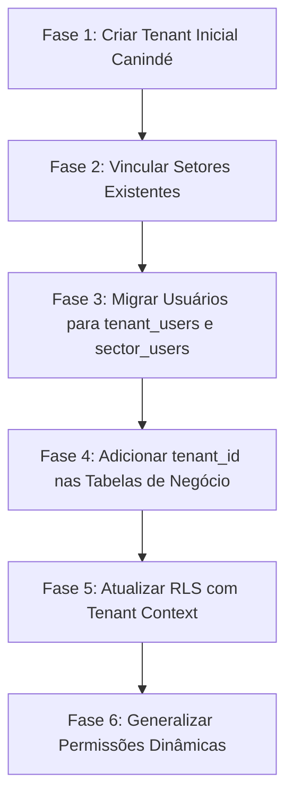

# MAPEAMENTO ATUAL PARA MIGRAÇÃO MULTITENANT E PERMISSÕES DINÂMICAS

> **Projeto:** SITE-SMST (Sistema da Secretaria Municipal de Segurança Pública e Trânsito)  
> **Data de Mapeamento:** Agosto / 2026  
> **Objetivo:** Documentação exaustiva da arquitetura atual (Banco de Dados, Autenticação, RPCs, RLS, Frontend e Regras de Negócio) para fundamentar a migração para **Multitenancy** e **Permissões Dinâmicas Granulares**.

---

## 1. Estrutura Atual do Banco de Dados

### 1.1 Tabelas Centrais de Usuários, Setores e Módulos

#### `public.setores`
```sql
CREATE TABLE IF NOT EXISTS public.setores (
  id uuid PRIMARY KEY DEFAULT gen_random_uuid(),
  nome text NOT NULL,
  slug text NOT NULL UNIQUE,
  descricao text,
  ativo boolean NOT NULL DEFAULT true,
  tem_pagina_publica boolean NOT NULL DEFAULT false,
  created_at timestamptz NOT NULL DEFAULT now(),
  updated_at timestamptz NOT NULL DEFAULT now()
);
```

#### `public.perfis_usuarios`
```sql
CREATE TYPE public.papel_usuario AS ENUM ('super_admin', 'gestor', 'admin_setor', 'tecnico');

CREATE TABLE IF NOT EXISTS public.perfis_usuarios (
  id uuid PRIMARY KEY DEFAULT gen_random_uuid(),
  user_id uuid NOT NULL REFERENCES auth.users(id) ON DELETE CASCADE,
  setor_id uuid REFERENCES public.setores(id) ON DELETE CASCADE,
  papel public.papel_usuario NOT NULL,
  nome text,
  sobrenome text,
  graduacao_id uuid REFERENCES public.guarda_municipal_graduacoes(id) ON DELETE SET NULL,
  ativo boolean NOT NULL DEFAULT true,
  created_at timestamptz NOT NULL DEFAULT now(),
  updated_at timestamptz NOT NULL DEFAULT now(),
  CONSTRAINT perfis_usuarios_super_admin_setor_check
    CHECK (
      (papel = 'super_admin' AND setor_id IS NULL)
      OR (papel <> 'super_admin' AND setor_id IS NOT NULL)
    )
);

CREATE UNIQUE INDEX perfis_usuarios_user_setor_unq 
  ON public.perfis_usuarios (user_id, setor_id) WHERE setor_id IS NOT NULL;
```

#### `public.auditoria_logs`
```sql
CREATE TABLE IF NOT EXISTS public.auditoria_logs (
  id uuid PRIMARY KEY DEFAULT gen_random_uuid(),
  user_id uuid REFERENCES auth.users(id) ON DELETE SET NULL,
  setor_id uuid REFERENCES public.setores(id) ON DELETE SET NULL,
  entidade text NOT NULL,
  entidade_id uuid,
  acao text NOT NULL,
  payload_resumido jsonb,
  created_at timestamptz NOT NULL DEFAULT now()
);
```

---

### 1.2 Principais Tabelas por Módulo e Setor

#### A. Guarda Municipal (`guarda_*`, `guardas_*`, `iro_*`)
* **`guardas_municipais`**: Cadastro institucional dos agentes (`matricula`, `nome`, `cpf`, `graduacao_id`, `data_graduacao`, `email`, `telefone`, `ativo`, `aceitou_lei_iro_at`).
* **`guarda_municipal_graduacoes`**: Graduações hierárquicas (`id`, `nome`, `ordem`, `ativo`).
* **`guardas_usuarios`**: Tabela de vínculo entre `auth.users(id)` e `guardas_municipais(id)`.
* **`guarda_afastamentos`**: Registro de férias, licenças prêmio e outros afastamentos dos guardas.
* **`guarda_graduacao_historico`**: Histórico de promoções e alterações de graduação.
* **`guarda_contatos_emergencia` & `guarda_informacoes_saude`**: Ficha pessoal e de saúde do guarda.
* **`guarda_frota_veiculos`**, **`guarda_frota_manutencoes`**, **`guarda_frota_indisponibilidades`**, **`guarda_frota_documentos`**: Gestão da frota própria da Guarda Municipal.
* **`guarda_equipes` & `guarda_equipe_membros`**: Formação de equipes operacionais e seus integrantes.
* **`guarda_escalas` & `guarda_escala_agentes`**: Gestão de turnos, postos de serviço e atribuição de guardas nas escalas.
* **`guarda_escala_versoes`**, **`guarda_solicitacoes`**, **`guarda_solicitacao_interacoes`**: Controle de versões da escala, registro de ciência e solicitações de permuta/troca de serviço.
* **`guarda_ordens_servico`**, **`guarda_ordens_servico_equipes`**, **`guarda_ordens_servico_historico`**: Ordens de Serviço (O.S.) da Guarda (e integração com DEMUTRAN).
* **`iro_operacoes`**, **`iro_candidaturas`**, **`iro_justificativas`**, **`iro_horas_manuais`**, **`iro_banco_horas`**, **`iro_valores_graduacao`**: Módulo IRO (Integracao de Recursos Operacionais / Horas Extras Gratificadas).
* **`demutran_fiscalizacao_infracoes` & `demutran_fiscalizacao_constatacoes`**: Tabela de enquadramentos de infrações (MBFT) e relatórios de fiscalização.

#### B. DEMUTRAN (`demutran_*`)
* **`demutran_veiculos_recolhidos`**: Veículos apreendidos no pátio municipal (`placa`, `chassi`, `proprietario_nome`, `bairro_apreensao`, `motivo`, `status`, `local_custodia`, `numero_liberacao`, `liberado_por`, `setor_id`).
* **`demutran_veiculos_municipais`**: Frota oficial do município sob supervisão do DEMUTRAN.
* **`demutran_concessionarios`**: Cadastro de mototaxistas, taxistas, transportes de horário e fretistas (`categoria`, `titular_nome`, `cpf`, `placa`, `concessao_arquivo_url`, `setor_id`).
* **`demutran_concessionario_usuarios`**: Portal do concessionário para auto-cadastro e acompanhamento.
* **`demutran_credenciais_solicitacoes`**: Emissão de credenciais de estacionamento para Idosos e PCD.
* **`demutran_recursos`**: Processos de defesa prévia e recursos de multas junto à JARI.
* **`demutran_midias`**: Conteúdos educativos e mídias do trânsito.
* **`demutran_taxas`**: Configuração das taxas de guincho e diárias de custódia.

#### C. Jovem Guarda Cidadã (`jgc_*`)
* **`jgc_configuracoes`**: Parâmetros gerais do projeto socioeducativo.
* **`jgc_perfis`**: Perfis funcionais internos do JGC (`gestor`, `administrativo`, `professor`, `multiprofissional`).
* **`jgc_alunos` & `jgc_aluno_turmas`**: Alunos matriculados, foto, dados pessoais e vínculo com turmas.
* **`jgc_aluno_saude`**: Ficha de saúde, alergias, laudos e necessidades especiais.
* **`jgc_responsaveis`**: Dados dos pais e responsáveis legais.
* **`jgc_turmas` & `jgc_turma_professores`**: Turmas, horários e instrutores/professores vinculados.
* **`jgc_diarios` & `jgc_frequencias`**: Registro de diário de classe e controle diário de frequência.
* **`jgc_atividades` & `jgc_atividade_participantes`**: Eventos, oficinas, passeios e aulas especiais.
* **`jgc_atendimentos`**: Registros de atendimento psicossocial e multidisciplinar (`privacidade`: `compartilhado`, `restrito`, `sigiloso`).
* **`jgc_acoes` & `jgc_encaminhamentos`**: Encaminhamentos para rede de proteção social (CRAS, CREAS, Conselho Tutelar).
* **`jgc_chamadas_gerais` & `jgc_chamada_geral_alunos`**: Registro de chamadas em eventos gerais do projeto.

---

### 1.3 Mapeamento de Tabelas: Presença de `setor_id` e Relações Globais

| Tabela | Possui `setor_id`? | Escopo do Dado | Relação Direta com `auth.users` |
| :--- | :---: | :---: | :---: |
| `setores` | N/A (É a entidade) | Global | Não |
| `perfis_usuarios` | **SIM** (nullable para super_admin) | Vínculo Usuário-Setor | `user_id` -> `auth.users(id)` |
| `auditoria_logs` | **SIM** | Auditoria por Setor/Global | `user_id` -> `auth.users(id)` |
| `demutran_veiculos_recolhidos` | **SIM** | Setor DEMUTRAN | Não (criado por perfil) |
| `demutran_veiculos_municipais` | **SIM** | Setor DEMUTRAN | Não |
| `demutran_concessionarios` | **SIM** | Setor DEMUTRAN | Não |
| `demutran_credenciais_solicitacoes` | **SIM** | Setor DEMUTRAN | Não |
| `demutran_recursos` | **SIM** | Setor DEMUTRAN | Não |
| `demutran_midias` | **SIM** | Setor DEMUTRAN | `created_by` -> `auth.users(id)` |
| `guarda_ordens_servico` | **SIM** | Guarda / DEMUTRAN | `criado_por` -> `auth.users(id)` |
| `iro_operacoes` | **SIM** | Guarda Municipal | `created_by` -> `auth.users(id)` |
| `iro_horas_manuais` | **SIM** | Guarda Municipal | `usuario_id` -> `auth.users(id)` |
| `guardas_municipais` | **NÃO** | Pertence à Guarda Municipal | Não (vinculado via `guardas_usuarios`) |
| `guardas_usuarios` | **NÃO** | Vínculo Institucional Guarda-Conta | `usuario_id` -> `auth.users(id)` |
| `guarda_escalas` | **NÃO** | Específico da Guarda | `criado_por` -> `auth.users(id)` |
| `guarda_equipes` | **NÃO** | Específico da Guarda | `criado_por` -> `auth.users(id)` |
| `guarda_frota_veiculos` | **NÃO** | Específico da Guarda | Não |
| `jgc_alunos` (e sub-tabelas JGC) | **NÃO** | Específico do Jovem Guarda | `criado_por` -> `auth.users(id)` |
| `jgc_perfis` | **NÃO** | Vínculo de perfil JGC | `perfil_usuario_id` -> `perfis_usuarios(id)` |
| `demutran_concessionario_usuarios`| **NÃO** | Portal do Concessionário | `usuario_id` -> `auth.users(id)` |
| `documentos` | **SIM** | Por Setor | `criado_por` -> `auth.users(id)` |
| `noticias` / `eventos` / `paginas` | **NÃO** | Portal Público Global | Não |

---

## 2. Estrutura Atual de Autenticação e Perfil

### 2.1 Papéis Existentes (`papel_usuario`)
Enum Postgres: `public.papel_usuario`
* **`super_admin`**: Acesso irrestrito a todos os setores, gestão global de usuários e configurações da plataforma. (`setor_id` obrigatório ser `NULL`).
* **`gestor`**: Administrador principal de um setor específico (`setor_id` obrigatório).
* **`admin_setor`**: Sub-gestor com permissões administrativas equivalentes às do gestor dentro do setor.
* **`tecnico`**: Usuário operacional do setor (no DEMUTRAN atua no atendimento; na Guarda atua nas rotinas administrativas; no JGC atua conforme os módulos).

### 2.2 Conexão entre `auth.users` e o Perfil do Usuário
A ligação primária ocorre pela chave estrangeira `perfis_usuarios.user_id -> auth.users.id`.
Ao realizar login, o frontend executa a RPC `get_user_profile()`, que consulta `auth.users` e junta com `perfis_usuarios` e `setores`.

### 2.3 Uso Atual de `raw_app_meta_data`
O campo `raw_app_meta_data` em `auth.users` armazena um objeto JSONB.
**Conteúdo típico:**
```json
{
  "provider": "email",
  "providers": ["email"],
  "created_via": "provision-admin-user",
  "modulos": [
    "veiculos",
    "concessionarios",
    "credenciais",
    "jovem_guarda.alunos.visualizar",
    "jovem_guarda.alunos.criar"
  ]
}
```

### 2.4 Obtenção do Setor Atual Após o Login
No frontend, o `AuthContext` executa `fetchUserProfile()` que chama `supabase.rpc('get_user_profile')`.
O payload retornado é estruturado da seguinte forma:
```json
{
  "user_id": "uuid-do-usuario",
  "email": "usuario@caninde.ce.gov.br",
  "name": "Nome Sobrenome",
  "papel": "gestor",
  "perfil_id": "uuid-do-perfil",
  "setor_id": "uuid-do-setor",
  "setor_nome": "DEMUTRAN",
  "setor_slug": "demutran",
  "ativo": true,
  "legacy_admin": false
}
```

### 2.5 Confirmação: Um Usuário Pode Ter Mais de Um Setor Hoje?
**Técnica e Praticamente NÃO.**
* A tabela `perfis_usuarios` possui o índice único `perfis_usuarios_user_setor_unq (user_id, setor_id)`.
* Embora a RPC `get_user_profile()` utilize `LIMIT 1`, a rotina de provisionamento (`provision_admin_user`) assume vínculo com um único `setor_id`.
* **Exceção parcial:** Um usuário pode ter um perfil de administrador em um setor e estar cadastrado como agente da Guarda na tabela `guardas_usuarios`. O `AuthContext` trata essa condição por meio de uma checagem secundária (`tem_guarda`).

---

## 3. RPCs e Funções de Autorização Atuais

### 3.1 `provision_admin_user`
Cria o usuário na tabela `auth.users`, cria a identidade na `auth.identities`, grava `raw_app_meta_data.modulos`, cria o registro na `perfis_usuarios` e grava o log de auditoria.

```sql
CREATE OR REPLACE FUNCTION public.provision_admin_user(
  _email text, _password text, _first_name text, _last_name text,
  _setor_id uuid, _papel public.papel_usuario, _active boolean DEFAULT true,
  _modulos jsonb DEFAULT NULL
) RETURNS jsonb ...
```

### 3.2 `is_super_admin()` e `is_gestor_setor()`
```sql
CREATE OR REPLACE FUNCTION public.is_super_admin()
RETURNS boolean LANGUAGE sql STABLE SECURITY DEFINER SET search_path TO 'public' AS $$
  SELECT EXISTS (
    SELECT 1 FROM public.perfis_usuarios
    WHERE user_id = auth.uid() AND papel = 'super_admin'::public.papel_usuario AND ativo = true
  ) OR public.has_legacy_admin(auth.uid());
$$;

CREATE OR REPLACE FUNCTION public.is_gestor_setor(_setor_id uuid)
RETURNS boolean LANGUAGE sql STABLE SECURITY DEFINER SET search_path TO 'public' AS $$
  SELECT public.is_super_admin()
    OR EXISTS (
      SELECT 1 FROM public.perfis_usuarios
      WHERE user_id = auth.uid() AND setor_id = _setor_id AND papel = 'gestor' AND ativo = true
    );
$$;
```

### 3.3 Funções de Manutenção de Perfil (`activate_profile`, `update_profile`, `delete_profile`, `update_profile_modulos`)
* **`activate_profile(_perfil_id)`**: Reativa perfil (`ativo = true`) mediante checagem de `is_super_admin()` ou `is_admin_of_setor()`.
* **`update_profile(_perfil_id, _nome, _sobrenome, _papel, _setor_id)`**: Atualiza dados cadastrais e papel do usuário.
* **`delete_profile(_perfil_id)`**: Remove o perfil de `perfis_usuarios` (restrito ao Super Admin).
* **`update_profile_modulos(_user_id, _modulos)`**: Atualiza diretamente o campo `raw_app_meta_data->'modulos'` na tabela `auth.users`.

### 3.4 Permissões Granulares do Jovem Guarda (`jgc_tem_permissao`, `jgc_definir_perfil`, `update_profile_jgc_permissions`)
* **`jgc_tem_permissao(_permissao)`**: Verifica se o usuário autenticado possui a chave de permissão (ex: `'jovem_guarda.alunos.criar'`) em `auth.users.raw_app_meta_data->'modulos'` ou se é gestor/super_admin.
* **`jgc_definir_perfil(_perfil_usuario_id, _perfil, _area_atuacao)`**: Atribui o perfil funcional JGC em `public.jgc_perfis` (`gestor`, `administrativo`, `professor`, `multiprofissional`).
* **`update_profile_jgc_permissions(_user_id, _permissoes)`**: Valida e grava permissões granulares com prefixo `jovem_guarda.` no `app_metadata`.

---

## 4. Exemplos Reais de Policies RLS Atuais

### 4.1 Tabela Simples (`public.setores`)
```sql
CREATE POLICY "Super admins e gestores manage setores" ON public.setores
FOR ALL TO authenticated
USING (public.is_super_admin())
WITH CHECK (public.is_super_admin());

CREATE POLICY "Public read active setores" ON public.setores
FOR SELECT USING (ativo = true);
```

### 4.2 Tabela da Guarda (`public.guarda_escalas`)
```sql
CREATE POLICY "Guarda gestores gerenciam escalas" ON public.guarda_escalas
FOR ALL TO authenticated
USING (
  public.is_super_admin() OR EXISTS (
    SELECT 1 FROM public.perfis_usuarios pu
    JOIN public.setores s ON s.id = pu.setor_id
    WHERE pu.user_id = auth.uid() AND pu.ativo = true
      AND s.slug = 'guarda-municipal' AND pu.papel IN ('gestor', 'admin_setor')
  )
);

CREATE POLICY "Guardas visualizam escalas ativas" ON public.guarda_escalas
FOR SELECT TO authenticated
USING (
  public.is_super_admin() OR public.is_guarda_autenticado() OR EXISTS (
    SELECT 1 FROM public.perfis_usuarios pu
    JOIN public.setores s ON s.id = pu.setor_id
    WHERE pu.user_id = auth.uid() AND pu.ativo = true AND s.slug = 'guarda-municipal'
  )
);
```

### 4.3 Tabela do DEMUTRAN (`public.demutran_veiculos_recolhidos`)
```sql
CREATE POLICY "Usuarios do DEMUTRAN gerenciam veiculos recolhidos" ON public.demutran_veiculos_recolhidos
FOR ALL TO authenticated
USING (
  public.is_super_admin() OR EXISTS (
    SELECT 1 FROM public.perfis_usuarios pu
    WHERE pu.user_id = auth.uid() AND pu.setor_id = demutran_veiculos_recolhidos.setor_id AND pu.ativo = true
  )
)
WITH CHECK (
  public.is_super_admin() OR EXISTS (
    SELECT 1 FROM public.perfis_usuarios pu
    WHERE pu.user_id = auth.uid() AND pu.setor_id = demutran_veiculos_recolhidos.setor_id AND pu.ativo = true
  )
);
```

### 4.4 Tabela do Jovem Guarda Cidadã (`public.jgc_alunos`)
```sql
CREATE POLICY "jgc_alunos_select" ON public.jgc_alunos FOR SELECT TO authenticated
  USING (public.jgc_tem_permissao('jovem_guarda.alunos.visualizar'));

CREATE POLICY "jgc_alunos_update" ON public.jgc_alunos FOR UPDATE TO authenticated
  USING (public.jgc_tem_permissao('jovem_guarda.alunos.editar') OR public.jgc_tem_permissao('jovem_guarda.alunos.inativar'))
  WITH CHECK (public.jgc_tem_permissao('jovem_guarda.alunos.editar') OR public.jgc_tem_permissao('jovem_guarda.alunos.inativar'));
```

### 4.5 Tabela de Perfis de Usuários (`public.perfis_usuarios`)
```sql
CREATE POLICY "Users can view active profiles in their sector" ON public.perfis_usuarios
FOR SELECT TO authenticated
USING (
  public.is_super_admin() OR user_id = auth.uid() OR setor_id IN (
    SELECT setor_id FROM public.perfis_usuarios WHERE user_id = auth.uid() AND ativo = true
  )
);
```

> **Análise do Padrão de RLS:** As políticas vigentes realizam a filtragem combinando: **usuário** (`auth.uid()`), **papel** (`papel = 'gestor'`), **setor** (`pu.setor_id = setor_id`), ou chamadas a funções auxiliares (`is_super_admin()`, `jgc_tem_permissao()`). **Não existe validação de `tenant_id`.**

---

## 5. Catálogo Atual de Setores e Módulos

### 1. Guarda Municipal
* **Rota principal:** `/admin/dashboard/guarda-municipal`
* **Menus & Módulos:** Home/Dashboard, Fala Cidadão, Ordens de Serviço, Escalas, IROs, Guardas, Frota da Guarda, Equipes, Mídias, Configurações, Usuários, Minhas IROs, Fiscalização (MBFT), Anotações, Perfil.
* **Perfis que acessam:** `super_admin`, `gestor`, `admin_setor`, `tecnico` (operacional/guarda).

### 2. DEMUTRAN (Departamento Municipal de Trânsito)
* **Rota principal:** `/admin/dashboard/demutran`
* **Menus & Módulos:** Dashboard, Fala Cidadão, IRO, Ordens de Serviço, Anotações, Relatórios, Veículos Recolhidos, Concessionários, Credenciais (Idoso/PCD), Recursos (JARI), Frota Municipal, Documentos, Mídias, Configurações, Usuários, Perfil.
* **Perfis que acessam:** `super_admin`, `gestor`, `admin_setor`, `tecnico`.

### 3. Jovem Guarda Cidadã
* **Rota principal:** `/admin/dashboard/jovem-guarda`
* **Menus & Módulos:** Home/Dashboard, Alunos, Responsáveis, Turmas, Diário de Classe, Atividades, Acompanhamentos Socioeducativos, Relatórios, Documentos, Usuários, Anotações, Perfil.
* **Perfis funcionais JGC:** `gestor`, `administrativo`, `professor`, `multiprofissional`.

### 4. Administrativo / Plataforma Global (SMST)
* **Rota principal:** `/admin/dashboard`
* **Menus & Módulos:** Setores, IROs Globais, Relatórios Executivos, Anotações Globais, Gestão Geral de Usuários.
* **Perfis que acessam:** `super_admin`.

---

## 6. Regras de Negócio Vigentes por Setor

### 6.1 Guarda Municipal
* **Escalas:** Somente Gestor / Admin de Setor elabora e publica a escala. Os Guardas Municipais logam para visualizar seus turnos, confirmar ciência e solicitar permuta/troca de serviço.
* **IROs (Horas Extras):** Gestores cadastram operações com limite de vagas e valor por hora (vinculado à graduação). Guardas candidatam-se; o sistema ou gestor confirma a vaga.
* **Ordens de Serviço (O.S.):** Gestores criam e publicam O.S. vinculando viaturas e equipes. O.S. compartilhadas podem ser enviadas ao DEMUTRAN.
* **Equipes e Frota:** Gestores definem a alocação de viaturas, registram indisponibilidades/manutenções e compõem as equipes operacionais.

### 6.2 DEMUTRAN
* **Veículos Recolhidos:** Técnicos e Gestores registram a apreensão de veículos no pátio. A liberação requer a quitação/conferência de taxas diárias e emissão de termo assinado com número de liberação.
* **Concessionários:** Cadastro de mototaxistas e taxistas com emissão de Alvará e controle de documentação. O concessionário pode possuir conta de acesso externo para consultar notificações.
* **Credenciais & Recursos:** Processamento de solicitações públicas de credenciais de estacionamento e instrução de defesas prévias de multas.

### 6.3 Jovem Guarda Cidadã
* **Turmas & Frequência:** Professores/Instrutores acessam o diário para lançar a frequência dos alunos das turmas sob sua responsabilidade.
* **Acompanhamento Socioeducativo:** Registros elaborados por psicólogos ou assistentes sociais possuem controle rígido de privacidade (`compartilhado`, `restrito`, `sigiloso`).
* **Matrícula e Cadastro:** Setor Administrativo realiza a matrícula, vinculação com responsáveis e upload de documentos.

---

## 7. Estrutura de Usuários no Frontend

### 7.1 Componentes Principais
* **`src/pages/admin/Usuarios.tsx`**: Tela completa de gestão de usuários. Oferece formulário com nome, e-mail, senha, seleção de papel (`gestor`, `tecnico`), seleção de setor e marcação dinâmica de módulos acessíveis (`MODULOS_POR_SETOR`). Para o Jovem Guarda, exibe o painel de atribuição de perfil JGC (`administrativo`, `professor`, `multiprofissional`) e permissões granulares (`JGC_PERMISSION_MODULES`).
* **`src/components/admin/AdminLayout.tsx`**: Gerencia o menu lateral expansível. Calcula os itens visíveis (`visibleMenuItems`) filtrando por `sectorContext`, `allowedPapeis`, `allowedJgcPerfis` e o array `profile.modulos`.
* **`src/contexts/AuthContext.tsx`**: Contexto React de autenticação. Mantém o objeto `profile` (`AdminProfile`), os privilégios (`isSuperAdmin`, `isGuarda`, `canManageSector`) e os métodos de login/logout.

---

## 8. Definição Arquitetural do Multitenancy e Plano de Migração

### 8.1 Decisões de Design Confirmadas

1. **O usuário pode participar de mais de um tenant?**
   * **SIM.** A conta de autenticação (`auth.users`) será global. O usuário poderá possuir vínculos (`tenant_users`) com múltiplos municípios/organizações.

2. **Um usuário pode participar de múltiplos setores no mesmo tenant?**
   * **SIM.** O vínculo com o tenant (`tenant_users`) pode possuir múltiplos registros em `sector_users`.

3. **Fluxo de seleção pós-login:**
   * **Se possuir 1 único tenant:** Acesso direto à organização.
   * **Se possuir múltiplos tenants:** Apresentação de tela de seleção da organização. Após escolher o tenant, o usuário poderá alternar entre os setores autorizados.

4. **Super Admin da Plataforma:**
   * Terá acesso técnico global. As operações de manutenção em dados de tenants serão estritamente auditadas em log (`auditoria_logs`).

5. **Hierarquia Unificada de Papéis:**

```
PLATAFORMA
  └── platform_super_admin (Super Admin da Plataforma)
       └── TENANT (Ex: Prefeitura Municipal de Canindé)
            ├── tenant_admin (Administrador da Organização)
            └── SETOR (Ex: Guarda Municipal / DEMUTRAN)
                 ├── sector_manager (Gestor do Setor)
                 └── member (Usuário Operacional / Guarda / Técnico)
```

---

### 8.2 Modelo de Banco de Dados Multitenant Proposto

```sql
-- 1. Organizações (Tenants)
CREATE TABLE IF NOT EXISTS public.tenants (
  id uuid PRIMARY KEY DEFAULT gen_random_uuid(),
  nome text NOT NULL,
  slug text NOT NULL UNIQUE,
  cnpj text UNIQUE,
  cidade text NOT NULL,
  estado text NOT NULL DEFAULT 'CE',
  logo_url text,
  status text NOT NULL DEFAULT 'ativo',
  configuracoes jsonb DEFAULT '{}'::jsonb,
  created_at timestamptz NOT NULL DEFAULT now(),
  updated_at timestamptz NOT NULL DEFAULT now()
);

-- 2. Vínculo Conta-Tenant
CREATE TABLE IF NOT EXISTS public.tenant_users (
  id uuid PRIMARY KEY DEFAULT gen_random_uuid(),
  tenant_id uuid NOT NULL REFERENCES public.tenants(id) ON DELETE CASCADE,
  user_id uuid NOT NULL REFERENCES auth.users(id) ON DELETE CASCADE,
  papel_tenant text NOT NULL DEFAULT 'member', -- 'tenant_admin' | 'member'
  ativo boolean NOT NULL DEFAULT true,
  created_at timestamptz NOT NULL DEFAULT now(),
  CONSTRAINT tenant_users_unq UNIQUE (tenant_id, user_id)
);

-- 3. Setores vinculados ao Tenant
-- Adicionar tenant_id em public.setores:
ALTER TABLE public.setores ADD COLUMN IF NOT EXISTS tenant_id uuid REFERENCES public.tenants(id) ON DELETE CASCADE;

-- 4. Vínculo Usuário-Setor
CREATE TABLE IF NOT EXISTS public.sector_users (
  id uuid PRIMARY KEY DEFAULT gen_random_uuid(),
  tenant_user_id uuid NOT NULL REFERENCES public.tenant_users(id) ON DELETE CASCADE,
  setor_id uuid NOT NULL REFERENCES public.setores(id) ON DELETE CASCADE,
  papel_setor text NOT NULL DEFAULT 'member', -- 'sector_manager' | 'member'
  perfil_funcional_id uuid,
  ativo boolean NOT NULL DEFAULT true,
  created_at timestamptz NOT NULL DEFAULT now(),
  CONSTRAINT sector_users_unq UNIQUE (tenant_user_id, setor_id)
);

-- 5. Catálogo de Permissões Granulares
CREATE TABLE IF NOT EXISTS public.permissoes (
  id uuid PRIMARY KEY DEFAULT gen_random_uuid(),
  codigo text NOT NULL UNIQUE, -- ex: 'guarda.escalas.criar'
  modulo text NOT NULL,
  acao text NOT NULL,
  descricao text,
  created_at timestamptz NOT NULL DEFAULT now()
);

-- 6. Perfis Funcionais por Tenant/Setor
CREATE TABLE IF NOT EXISTS public.perfis_funcionais (
  id uuid PRIMARY KEY DEFAULT gen_random_uuid(),
  tenant_id uuid NOT NULL REFERENCES public.tenants(id) ON DELETE CASCADE,
  setor_id uuid REFERENCES public.setores(id) ON DELETE CASCADE,
  nome text NOT NULL,
  descricao text,
  ativo boolean NOT NULL DEFAULT true,
  created_at timestamptz NOT NULL DEFAULT now()
);

CREATE TABLE IF NOT EXISTS public.perfil_permissoes (
  perfil_funcional_id uuid REFERENCES public.perfis_funcionais(id) ON DELETE CASCADE,
  permissao_id uuid REFERENCES public.permissoes(id) ON DELETE CASCADE,
  PRIMARY KEY (perfil_funcional_id, permissao_id)
);
```

---

### 8.3 Roteiro de Migração em 6 Fases (Zero Downtime)



1. **Fase 1 — Instalação do Tenant Inicial:**
   * Inserção do registro base na tabela `tenants` (ex: `Prefeitura Municipal de Canindé`, slug: `caninde`).

2. **Fase 2 — Vinculação de Setores:**
   * Adição de `tenant_id` na tabela `setores` e preenchimento de todos os setores legados com o ID do tenant `caninde`. Alteração para `NOT NULL`.

3. **Fase 3 — Migração dos Usuários:**
   * Povoamento automático da tabela `tenant_users` a partir dos registros vigentes de `perfis_usuarios`.
   * Povoamento de `sector_users` mapeando os papéis antigos (`gestor` -> `sector_manager`, `tecnico` -> `member`).

4. **Fase 4 — Adição de `tenant_id` nas Tabelas de Negócio:**
   * Inclusão de `tenant_id` (nullable inicialmente) nas tabelas operacionais (`guarda_escalas`, `guarda_equipes`, `guarda_ordens_servico`, `demutran_veiculos_recolhidos`, `demutran_concessionarios`, `jgc_alunos`, `jgc_turmas`, `documentos`, `auditoria_logs`).
   * Execução de script de *backfill* preenchendo os registros com o `tenant_id` de Canindé.
   * Alteração da coluna `tenant_id` para `NOT NULL`.

5. **Fase 5 — Atualização Geral do RLS:**
   * Reescrever todas as políticas RLS para checar primeiramente o `tenant_id` proveniente da sessão/token JWT antes de validar permissões de setor ou papel.

6. **Fase 6 — Unificação de Permissões Dinâmicas:**
   * Migrar os módulos do DEMUTRAN, Guarda e Jovem Guarda para o catálogo unificado de permissões (`permissoes` e `perfil_permissoes`).

---

### 8.4 Resumo de Arquivos Impactados na Aplicação

* **Banco de Dados (Migrations):**
  * Novas migrations para `tenants`, `tenant_users`, `sector_users`, `permissoes`, `perfis_funcionais`.
  * Reformulação das RPCs: `provision_admin_user`, `get_user_profile`, `get_admin_profiles`.

* **Backend / Helpers:**
  * Atualização de `src/types/admin.ts` para incluir interfaces de `Tenant`, `TenantUser`, `SectorUser`.
  * Criação de RPC de seleção e troca de tenant ativo.

* **Frontend:**
  * `src/contexts/AuthContext.tsx`: Adicionar estado `activeTenantId` e rotinas de troca de organização.
  * `src/components/admin/AdminLayout.tsx`: Exibir seletor de tenant no cabeçalho/sidebar.
  * `src/pages/admin/Usuarios.tsx`: Adaptar formulário para criação no contexto tenant/setor.
